<p align="center">
  
</p>

<h1 align="center">Aurboda</h1>
<h3 align="center">Self-Hosted Self-Quantification Aggregator</h3>

<p align="center">
  <a href="https://codecov.io/gh/fiddur/aurboda"></a>
</p>

Your health, fitness, productivity, and location data is scattered across apps and services. Aurboda aggregates it all into one self-hosted platform, provides rich visualizations, and exposes everything to AI assistants via [MCP (Model Context Protocol)](https://modelcontextprotocol.io/).

Currently in early development. No public signup, but self-hosting is straightforward via Docker. It was initiated as a personal (manually coded) hobby project but has grown with AI coding; take it or leave it.

---

## Timeline

See your entire day at a glance. The timeline overlays activities, tags, metrics, screen time, music, and location on a single interactive view. Hover over any item for details -- exercise sets and reps, sleep scores and stages, what music was playing, where you were.

<p align="center">
  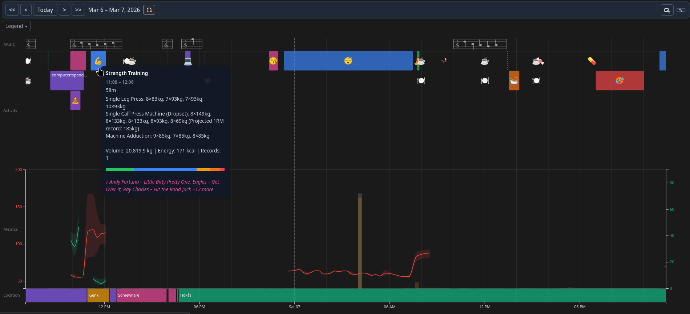
</p>

<p align="center">
  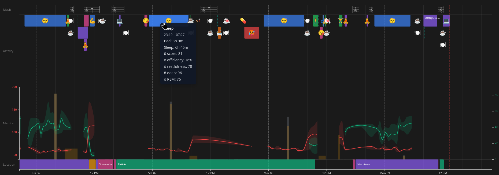
</p>

The timeline is fully responsive and works on mobile browsers too:

<p align="center">
  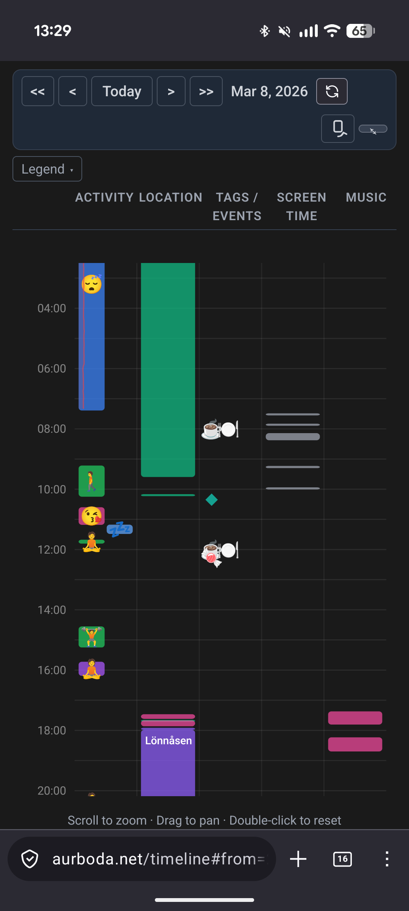
</p>

## HR Zones & Fitness Tracking

Track time spent in each heart rate zone across all your exercises. Set weekly goals for Zone 2 cardio and Zone 5 high-intensity work based on exercise science recommendations (Huberman/Galpin protocols).

<p align="center">
  
  &nbsp;&nbsp;&nbsp;&nbsp;
  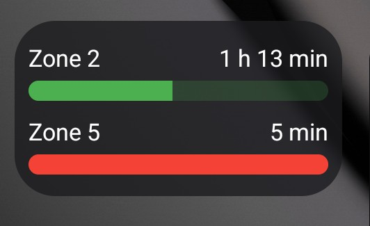
</p>

The Android app includes a home screen widget so you can see your weekly zone progress without opening the app.

## Trends (EMA)

Track any metric or tag frequency over time with Exponential Moving Average smoothing. Configurable half-life (7/15/30 days) and display periods (daily, weekly, monthly).

<p align="center">
  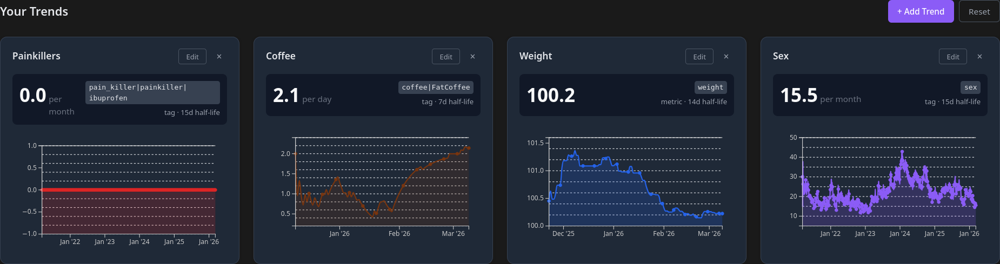
</p>

## Places & Location History

Visualize your daily movements on a map. Aurboda detects frequently visited locations, lets you name them, and tracks visit durations. Powered by OwnTracks and PostGIS.

<p align="center">
  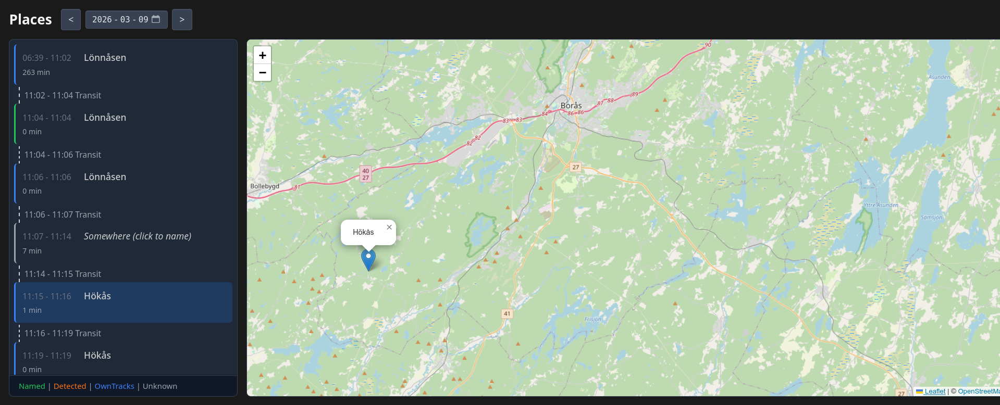
</p>

## AI-Ready via MCP

Connect Claude or other MCP-compatible AI assistants to your self-hosted instance. The AI gets full access to query your health data, find correlations, and generate personalized insights.

<p align="center">
  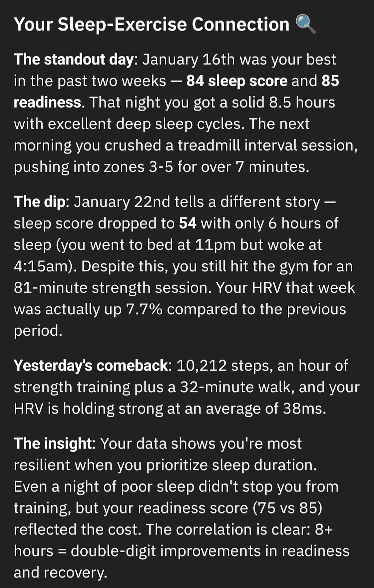
  &nbsp;&nbsp;&nbsp;&nbsp;
  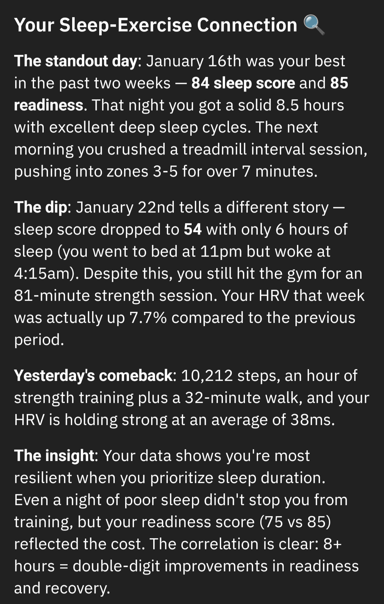
</p>

Example queries an AI can answer:

- "How was my sleep quality this week compared to last week?"
- "What's the correlation between my exercise and sleep scores?"
- "Show me days where I hit my Zone 2 cardio goals"
- "What's the probability of a headache the day after poor sleep?"

## Correlation Analysis

Go beyond simple charts. Aurboda computes statistical correlations between any combination of activities, tags, metrics, and productivity data. Includes Pearson correlation coefficients, chi-squared significance testing, relative risk ratios, and configurable lag windows (12h to 7 days).

Examples: Does evening exercise affect your sleep score? Does coffee intake correlate with HRV? What's the probability of a headache after a bad night?

## Android App

The companion Android app syncs data from Health Connect (40+ record types including heart rate, HRV, sleep, exercise, steps, weight, SpO2, and more). It also connects to BLE heart rate monitors (Polar H10, etc.) and step sensors (Zwift RunPod, etc.) for real-time tracking.

<p align="center">
  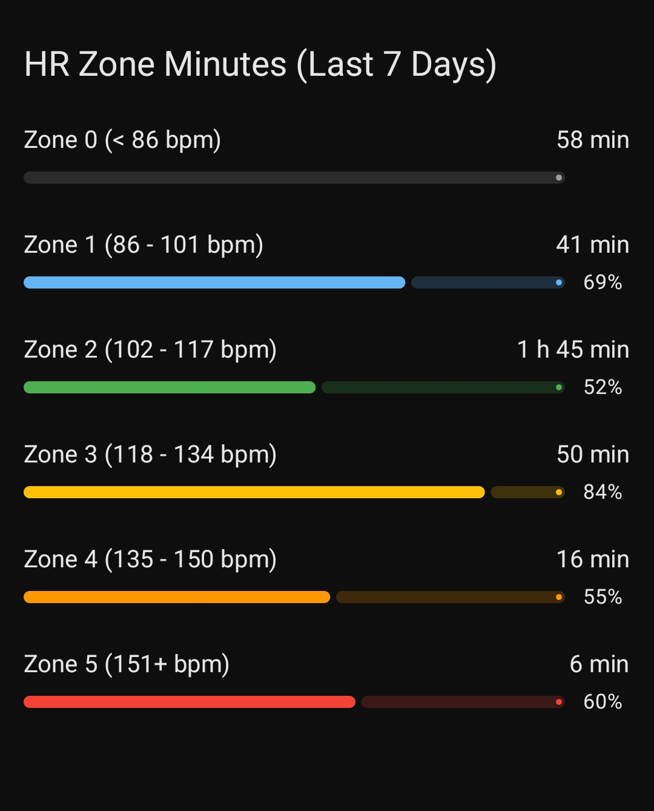
  &nbsp;&nbsp;
  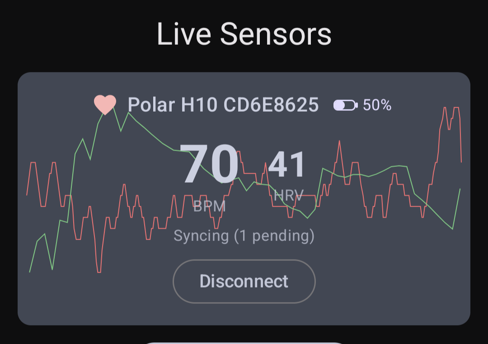
  &nbsp;&nbsp;
  
</p>

---

## Data Sources

Aurboda aggregates data from a wide range of sources. Each source has its own sync method and data types.

<p align="center">
  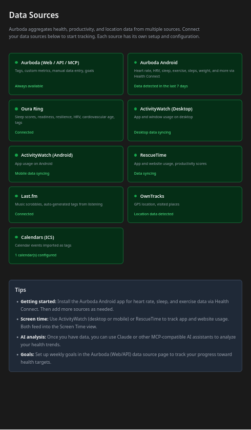
</p>

| Source                     | What it provides                                                                                                                                        | Sync method                          |
| -------------------------- | ------------------------------------------------------------------------------------------------------------------------------------------------------- | ------------------------------------ |
| **Android Health Connect** | Heart rate, HRV, sleep, exercise (80+ types), steps, weight, body composition, SpO2, respiratory rate, blood glucose, blood pressure, VO2 max, calories | Push from Android app (every 15 min) |
| **BLE Heart Rate Sensors** | Real-time heart rate and HRV (e.g. Polar H10)                                                                                                           | Live via Android app                 |
| **BLE Step Sensors**       | Real-time cadence and steps (e.g. Zwift RunPod)                                                                                                         | Live via Android app                 |
| **Oura Ring**              | Sleep stages/scores/efficiency, readiness, resilience, cardiovascular age, HRV, heart rate, meditation, user tags                                       | Pull (API) + Push (webhooks)         |
| **OwnTracks**              | GPS locations, geofences, place visits                                                                                                                  | Push (HTTP mode)                     |
| **RescueTime**             | App/website usage, productivity scores, categories                                                                                                      | Pull (API)                           |
| **ActivityWatch**          | App/window usage per device (desktop and Android)                                                                                                       | Push (agent script)                  |
| **Last.fm**                | Music scrobbles with auto-generated tags from configurable rules                                                                                        | Pull (API)                           |
| **Calendars (ICS)**        | Calendar events imported as tags (Google Calendar, Outlook, iCloud, Nextcloud, etc.)                                                                    | Pull (ICS fetch)                     |
| **Manual Entry**           | Any metric, tag, activity, or note                                                                                                                      | Web UI, REST API, or MCP             |

See [docs/data-sources.md](docs/data-sources.md) for detailed setup instructions for each source.

### Data Source Setup

| Source                 | Setup                                                                                                                                |
| ---------------------- | ------------------------------------------------------------------------------------------------------------------------------------ |
| Android Health Connect | Install the [Android APK](https://github.com/fiddur/aurboda/releases/download/latest/aurboda.apk), enter your server URL, and log in |
| BLE Heart Rate Sensors | Pair Bluetooth heart rate monitors via the app's Live screen                                                                         |
| BLE Step Sensors       | Pair Bluetooth running pods via the app's Live screen                                                                                |
| OwnTracks              | [OwnTracks setup guide](docs/owntracks.md) (JSON HTTP mode)                                                                          |
| Oura                   | Connect via OAuth in user settings. Requires `OURA_CLIENT` and `OURA_SECRET` env vars.                                               |
| RescueTime             | Configure API key in user settings. Get key from [RescueTime API settings](https://www.rescuetime.com/anapi/manage).                 |
| ActivityWatch          | Desktop agent script or Android companion app. See [docs/activitywatch.md](docs/activitywatch.md).                                   |
| Last.fm                | Configure API key in admin settings, username in user settings. See [docs/lastfm.md](docs/lastfm.md).                                |
| Calendars              | Add ICS URLs in user settings. See [docs/calendars.md](docs/calendars.md).                                                           |

---

## Quick Start (Docker)

```bash
# Download docker-compose.yml
curl -o docker-compose.yml https://raw.githubusercontent.com/fiddur/aurboda/main/docker-compose.yml

# Generate secure secrets (openssl ships with Git on Windows, standard on macOS/Linux)
sed -i.bak "s/REPLACE_DB_PASSWORD/$(openssl rand -hex 16)/" docker-compose.yml
sed -i.bak "s/REPLACE_SESSION_SECRET/$(openssl rand -hex 16)/" docker-compose.yml
rm docker-compose.yml.bak

# Start services
docker compose up -d
```

This starts:

- **aurboda** (web + API) on port 8080
- **PostgreSQL** with PostGIS
- **Watchtower** for automatic updates

### Creating Your User

Navigate to http://localhost:8080 and create your account through the web interface.

After creating your user, you can set `ALLOW_SIGNUP=false` in docker-compose.yml to disallow other signups.

### Environment Variables

| Variable         | Description                                | Default  |
| ---------------- | ------------------------------------------ | -------- |
| `SESSION_SECRET` | Secret for session tokens (32+ characters) | Required |
| `PGPASSWORD`     | PostgreSQL password                        | Required |
| `ALLOW_SIGNUP`   | Enable user registration endpoint          | `true`   |

### Port Configuration

To change default port, modify `"8080:80"` to `"YOUR_PORT:80"` in docker-compose.yml.

### Development Builds

Replace `:latest` with `:develop` in docker-compose.yml to use development builds.

---

## Key Capabilities

| Feature                  | Description                                                                                              |
| ------------------------ | -------------------------------------------------------------------------------------------------------- |
| **Timeline**             | Multi-layer chronological view: activities, tags, metrics, screen time, music, and location              |
| **Dashboard**            | Configurable widget-based dashboard with metric cards, sparklines, trend charts, and correlation widgets |
| **HR Zones**             | Weekly heart rate zone tracking with goals based on Huberman/Galpin protocols                            |
| **Sleep Analysis**       | Sleep stage breakdowns, scores, efficiency, latency, and sleep location detection                        |
| **Trends (EMA)**         | Exponential Moving Average charts for any metric or tag, with configurable smoothing                     |
| **Correlation Analysis** | Pearson coefficients, chi-squared tests, relative risk ratios between any data types                     |
| **Goals**                | Rolling-window health goals with "losing tomorrow" calculations                                          |
| **Places**               | GPS location history, auto-detected locations, visit tracking with PostGIS                               |
| **Productivity**         | Screen time tracking with productivity scoring and hierarchical categories                               |
| **Lab Results**          | Structured storage for blood work with reference ranges                                                  |
| **Notes**                | Markdown notes and comments attachable to any entity                                                     |
| **MCP Integration**      | Full AI assistant access to query, analyze, and correlate your health data                               |

---

## Architecture

```
                         +------------------+
                         |   Android App    |
                         | (Health Connect, |
                         |  BLE sensors)    |
                         +--------+---------+
                                  |
+------------------+     +--------v---------+     +------------------+
|  OwnTracks       +---->|     Backend      |<----+    Web UI        |
|  ActivityWatch   |     |  (REST API + MCP)|     |   (Preact)       |
|  Oura (webhooks) |     +--------+---------+     +------------------+
+------------------+         ^    |
                             |    |
+------------------+         |    v
|  Oura (API)      +---------+ +------------------+
|  RescueTime      |           |   PostgreSQL     |
|  Last.fm         |           |   (PostGIS)      |
|  Calendars (ICS) +---------+ +------------------+
+------------------+
```

**Components:**

- `apps/backend` -- Node.js/TypeScript API server with MCP support
- `apps/web` -- Preact-based visualization dashboard
- `apps/android` -- Kotlin/Jetpack Compose Health Connect client with BLE support
- `packages/api-spec` -- Shared Zod schemas, OpenAPI spec, generated TypeScript types and Kotlin models
- Database: PostgreSQL with PostGIS, per-user database isolation

---

## API Documentation

Interactive API documentation is available at https://aurboda.net/apispec (develop branch version).

---

## Development

```bash
pnpm install
pnpm fix    # Format and lint
pnpm check  # TypeScript checks
```

Backend requires PostgreSQL with PostGIS. Configure connection in `.env`:

```
PGHOST=localhost
PGPORT=5432
PGUSER=aurboda_service
PGPASSWORD=your_password
SESSION_SECRET=your_32_byte_secret
```

---

## About the Name

In Norse mythology, Aurboda (pronounced "owr-BO-tha", using a hard D in "aurboda") is a mountain jotunn associated with strength and vitality. Her name means "gravel-offerer" or "gold-offerer", reflecting her role as a gatherer and provider.

This project embodies that spirit: gathering scattered health data into a unified foundation for understanding your wellbeing.

---

## Contact

Questions or want access? Contact me on [reddit](https://www.reddit.com/user/fiddur/).
