<p align="center">
  
</p>

<h1 align="center">Aurboda</h1>
<h3 align="center">Self-Hosted Self-Quantification Aggregator</h3>

**A self-hosted personal data warehouse for quantified self.** Aurboda unifies your health, fitness, productivity, location, and nutrition data -- from Oura, Garmin, Strava, Android Health Connect, screen-time trackers, calendars, and more -- into a single timeline and database that lives on your own server.

Think of it as **Home Assistant, but for your personal data instead of your smart home.**

Once everything is in one place, you can:

- **Explore** it visually -- a unified timeline, customizable dashboards, and maps
- **Analyze** it -- trends, correlations, and statistics across every source
- **Own** it -- standard PostgreSQL on your machine, no cloud account, no subscription
- **Ask** it anything -- connect Claude or any MCP client and query your whole life in plain language

That last part is the point: instead of "my data is scattered across ten apps," you can finally ask _"is there a link between my coffee, HRV, sleep, and headaches?"_ -- and get an answer.

> No public signup. It began as a hand-coded personal hobby project and has since grown with AI-assisted coding; self-host your own instance and take it or leave it.

### Data Sources

Aurboda's reach is the point, so here's what it ingests today:

<!-- BEGIN:data-sources -->

| Source                                               | What it provides                                                                                       | How                              |
| ---------------------------------------------------- | ------------------------------------------------------------------------------------------------------ | -------------------------------- |
| [**Android Health Connect**](docs/health-connect.md) | Heart rate, HRV, sleep, exercise (80+ types), steps, weight, SpO2, VO2 max, calories, and more         | Push from Android app            |
| **BLE Sensors**                                      | Real-time heart rate, HRV (Polar H10, etc.) and steps (Zwift RunPod, etc.)                             | Live via Android app             |
| [**Oura Ring**](docs/oura.md)                        | Sleep stages/scores, readiness, resilience, cardiovascular age, HRV, heart rate, meditation, tags      | Pull (API) + Push (webhooks)     |
| [**Garmin Connect**](docs/garmin.md)                 | Daily summary, HR, HRV, sleep, stress, body battery, activities, SpO2, respiration, training readiness | Pull (session-based)             |
| [**Strava**](docs/strava.md)                         | Activities with per-second heart rate, GPS routes, cadence, and power                                  | Pull (API) + Push (webhooks)     |
| [**OwnTracks**](docs/owntracks.md)                   | GPS locations, geofences, place visits                                                                 | Push (HTTP mode)                 |
| [**RescueTime**](docs/rescuetime.md)                 | App/website usage, productivity scores, categories                                                     | Pull (API)                       |
| [**ActivityWatch**](docs/activitywatch.md)           | App/window usage per device (desktop and Android)                                                      | Push (agent script)              |
| [**Last.fm**](docs/lastfm.md)                        | Music scrobbles with auto-generated tags from configurable rules                                       | Pull (API)                       |
| [**Calendars (ICS)**](docs/calendars.md)             | Calendar events imported as tags (Google Calendar, Outlook, iCloud, Nextcloud, etc.)                   | Pull (ICS fetch)                 |
| **Cronometer**                                       | Meals with full per-item macros and ~50 micronutrients                                                 | CSV import                       |
| [**Livsmedelsverket**](docs/livsmedelsverket.md)     | Canonical food library: 2,500+ Swedish foods with macros + micros (per 100 g)                          | One-shot bulk import (UI button) |
| **Manual Entry**                                     | Any metric, tag, activity, meal, or note                                                               | Web UI, REST API, or MCP         |

<!-- END:data-sources -->

See [docs/data-sources.md](docs/data-sources.md) for setup overview.

### What you can do

Everything above feeds a common data model, so every feature works across every source:

- **Explore** -- [timeline](docs/features/timeline.md), [dashboards](docs/features/dashboard.md), and [maps of where you've been](docs/features/places.md)
- **Analyze** -- [trends with EMA smoothing](docs/features/trends.md), [correlations](docs/features/correlations.md) (Pearson, chi-squared, relative risk), and [goals](docs/features/goals.md)
- **Track health** -- [sleep](docs/features/sleep.md), [HR zones](docs/features/hr-zones.md), [training load](docs/features/training-load.md), [lab results](docs/features/lab-reports.md), and [active-calorie computation](docs/features/calories.md)
- **Organize life** -- [activities](docs/features/activity-types.md), [meals & nutrition](docs/features/meals.md), places, and [screen time](docs/features/screentime-categories.md)
- **Automate** -- [deduction rules](docs/features/deduction-rules.md) that create activities from your data, plus custom activity types
- **Share** -- read-only [public dashboards and federated challenges](docs/features/sharing.md) across Aurboda instances
- **AI access** -- full query access from Claude or any [MCP](docs/mcp-server.md) client (60+ tools)

Each links to detailed docs, and the sections below walk through the highlights with screenshots.

### Your data, your server

For the self-hosting crowd, the appeal is ownership:

- Your data stays on your machine -- no cloud account, no third party.
- No subscription, ever.
- Stored in **standard PostgreSQL** you can query directly.
- **Docker deployment** in minutes (see [Quick Start](#quick-start-docker)).
- Open **REST API** and **MCP** -- nothing is locked in.
- [Passkey / WebAuthn login](docs/passkeys.md) for web and Android.

---

## Timeline

See your entire day at a glance. The timeline overlays activities, tags, metrics, screen time, music, and location on a single interactive view. Hover over any item for details -- exercise sets and reps, sleep scores and stages, what music was playing, where you were.

<p align="center">
  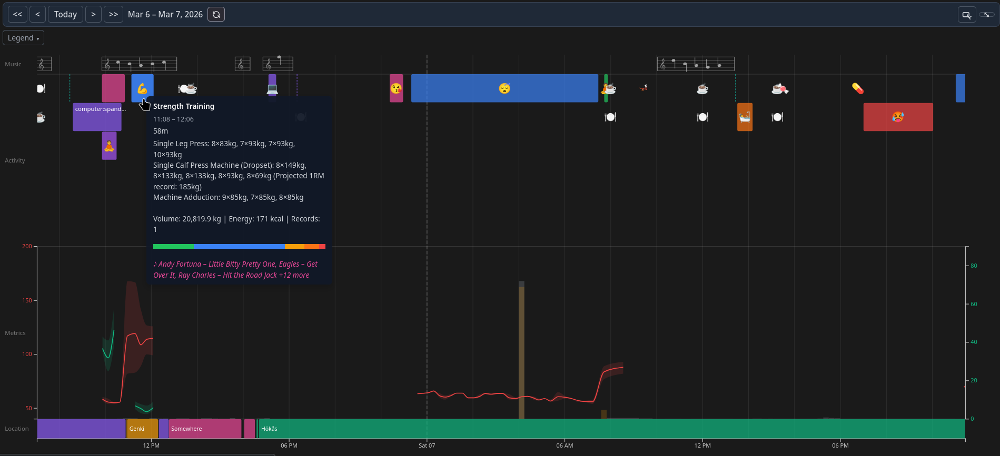
</p>

<p align="center">
  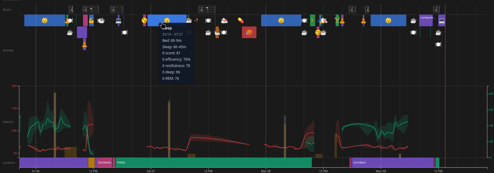
</p>

The timeline is fully responsive and works on mobile browsers too:

<p align="center">
  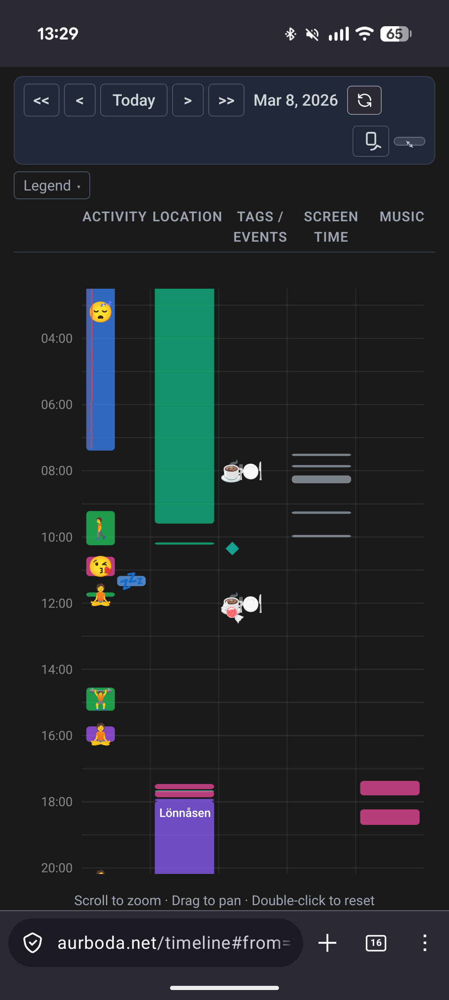
</p>

More in the [Timeline docs](docs/features/timeline.md).

## Dashboard

Your home page is a customizable grid of widgets -- metric cards, sparklines, trend arrows, goal progress, and charts -- organized into sections you can rearrange, add to, or remove. Dashboards can also be published read-only under your public profile (see [Sharing & Challenges](#sharing--challenges)); the one below is a public example.

<p align="center">
  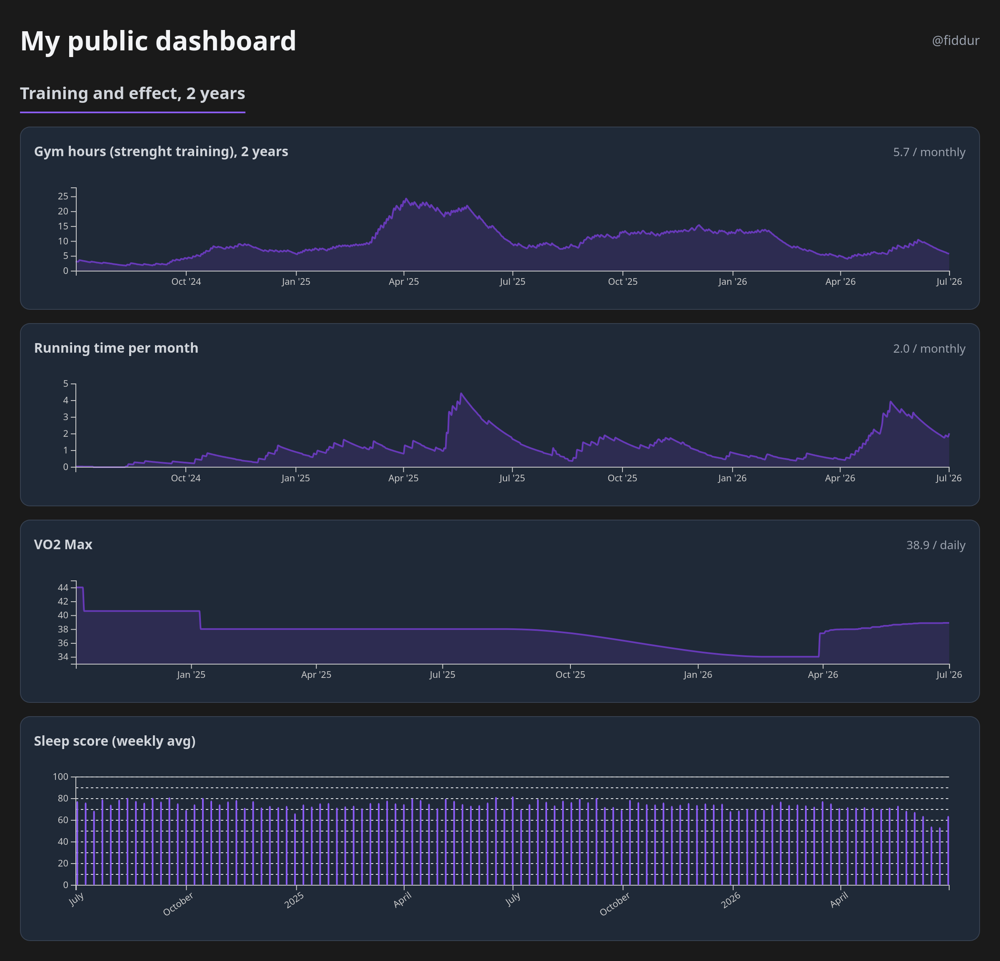
</p>

More in the [Dashboard docs](docs/features/dashboard.md).

## HR Zones & Fitness Tracking

Track time spent in each heart rate zone across all your exercises. Set weekly goals for Zone 2 cardio and Zone 5 high-intensity work based on exercise science recommendations (Huberman/Galpin protocols).

<p align="center">
  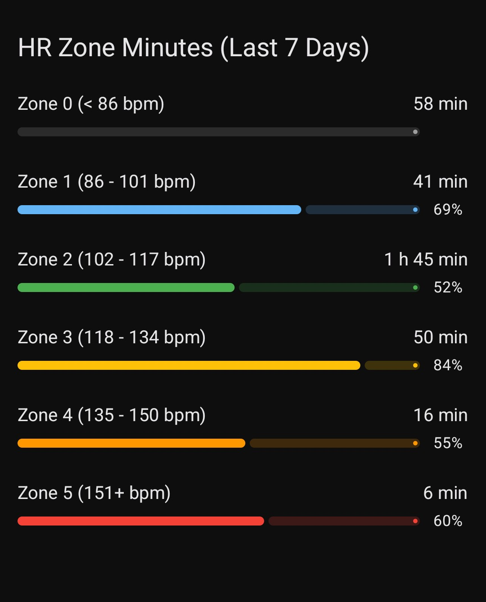
  &nbsp;&nbsp;&nbsp;&nbsp;
  
</p>

The Android app includes a home screen widget so you can see your weekly zone progress without opening the app.

More in the [HR Zones docs](docs/features/hr-zones.md).

## Trends (EMA)

Track any metric or tag frequency over time with Exponential Moving Average smoothing. Configurable half-life (7/15/30 days) and display periods (daily, weekly, monthly).

<p align="center">
  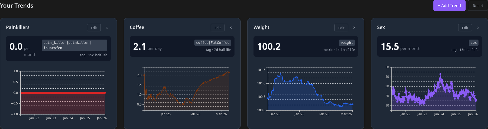
</p>

More in the [Trends docs](docs/features/trends.md).

## Meals & Nutrition

Log food fast and see how your intake stacks up over time. The day view gives you configurable meal slots (Breakfast, Lunch, Snack, Dinner) with one-tap quick-log chips for your frequent foods, per-item sensitivity/allergen flags, and a running day total for calories and every micronutrient.

<p align="center">
  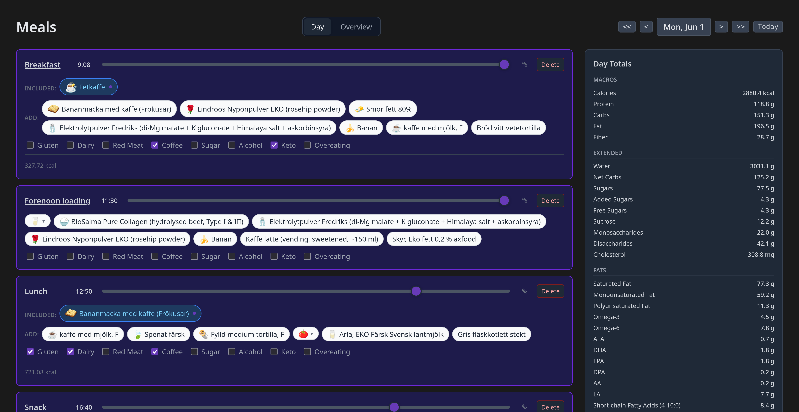
</p>

The **Overview** tab turns your log into a nutrient report. Average intake over **1, 7, 30, and 90 days** is shown side by side, each value plotted against its recommended min/max range (NNR2023 defaults, with per-user overrides). An energy-balance row compares average calories eaten against calories burned (from Garmin / Health Connect), so surplus or deficit is visible at a glance. Averaging ignores days with no meal data, so a sparse log isn't dragged toward zero.

<p align="center">
  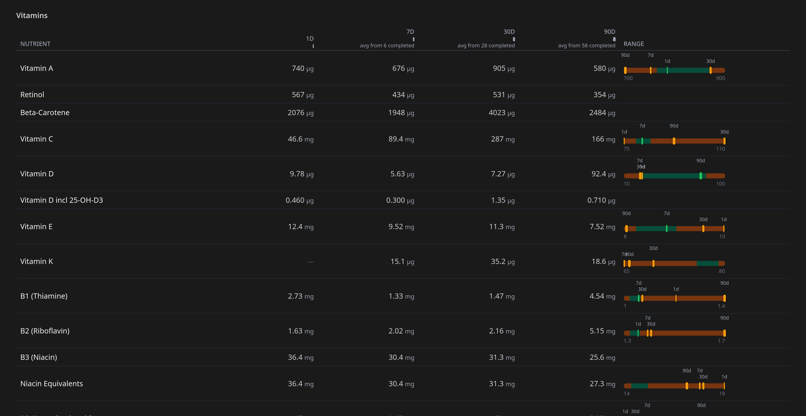
</p>

Import full macros and ~50 micronutrients from a Cronometer CSV export, pull meals from Oura, or build your own food library with composite recipes and custom portion units.

More in the [Meals & Nutrition docs](docs/features/meals.md).

## Places & Location History

Visualize your daily movements on a map. Aurboda detects frequently visited locations, lets you name them, and tracks visit durations. Powered by OwnTracks and PostGIS.

<p align="center">
  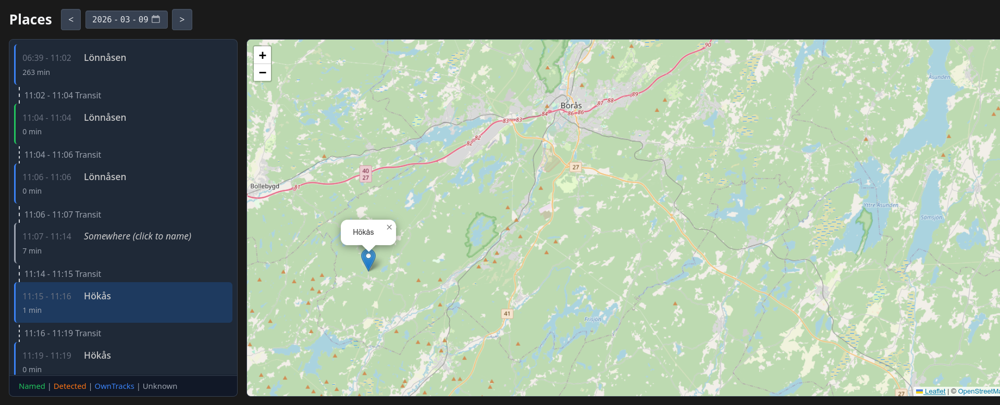
</p>

More in the [Places docs](docs/features/places.md).

## AI-Ready via MCP

Connect Claude or other MCP-compatible AI assistants to your self-hosted instance. The AI gets full access to query your health data, find correlations, and generate personalized insights.

<p align="center">
  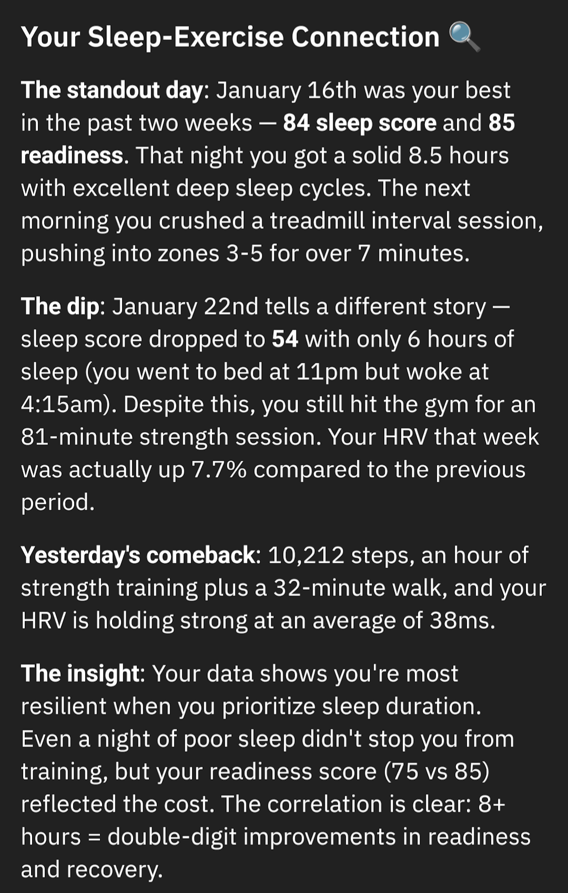
  &nbsp;&nbsp;&nbsp;&nbsp;
  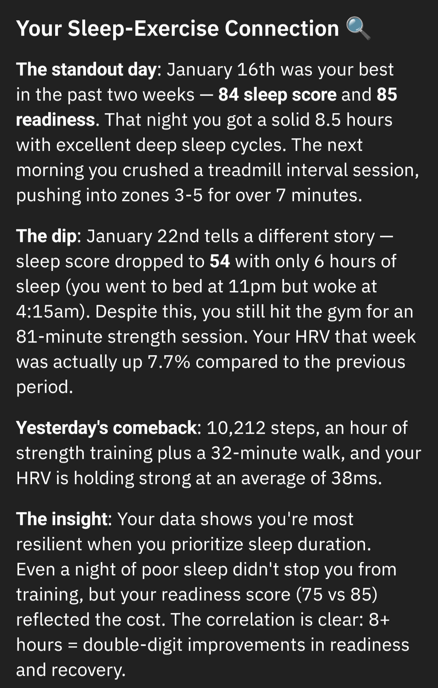
</p>

Example queries an AI can answer:

- "How was my sleep quality this week compared to last week?"
- "What's the correlation between my exercise and sleep scores?"
- "Show me days where I hit my Zone 2 cardio goals"
- "What's the probability of a headache the day after poor sleep?"

More in the [MCP server docs](docs/mcp-server.md).

## Correlation Analysis

Go beyond simple charts. Aurboda computes statistical correlations between any combination of activities, tags, metrics, and productivity data. Includes Pearson correlation coefficients, chi-squared significance testing, relative risk ratios, and configurable lag windows (12h to 7 days).

Examples: Does evening exercise affect your sleep score? Does coffee intake correlate with HRV? What's the probability of a headache after a bad night?

More in the [Correlation docs](docs/features/correlations.md).

## Sharing & Challenges

Publish read-only **shared dashboards** (like the one above) under your own public namespace (`/u/:username/:slug`), so anyone can view a curated set of charts without signing in. **Challenges** build on the same foundation: host a cumulative-metric or activity competition over a date span, let others join -- even from a different Aurboda instance -- and watch a live race chart and leaderboard of everyone's running total.

<p align="center">
  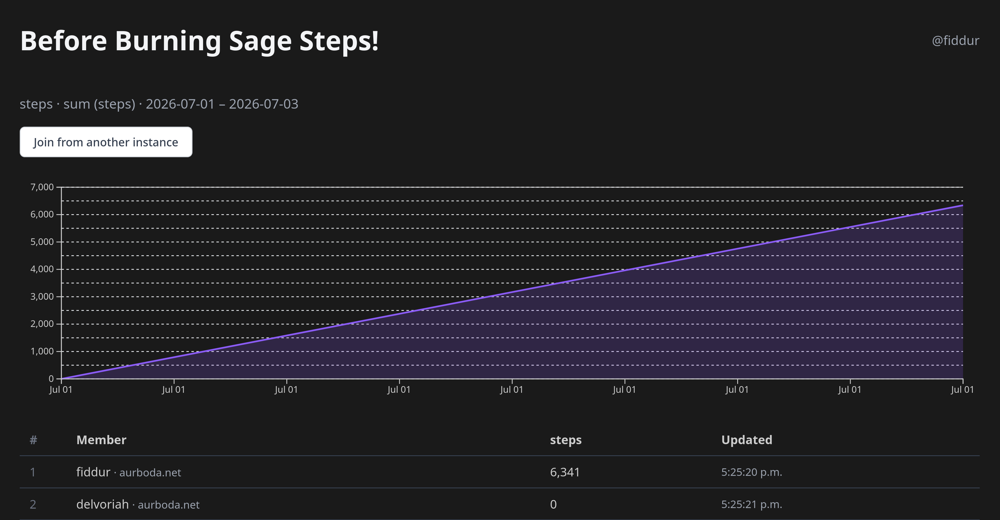
</p>

More in the [Sharing](docs/features/sharing.md) and [Challenges](docs/features/challenges.md) docs.

## Android App

The companion Android app syncs data from Health Connect (40+ record types including heart rate, HRV, sleep, exercise, steps, weight, SpO2, and more). It also connects to BLE heart rate monitors (Polar H10, etc.) and step sensors (Zwift RunPod, etc.) for real-time tracking.

<p align="center">
  
  &nbsp;&nbsp;
  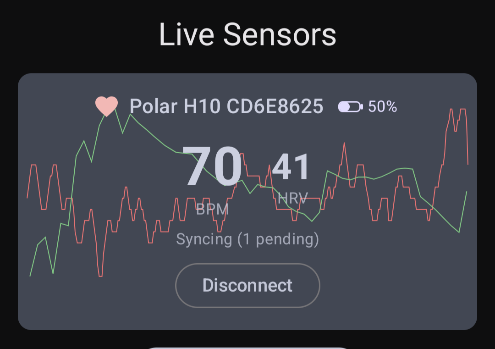
  &nbsp;&nbsp;
  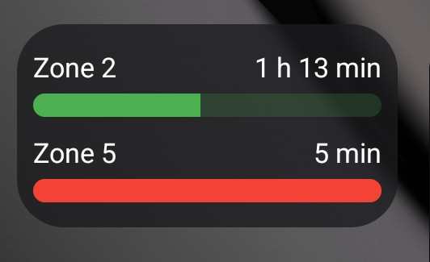
</p>

More in the [Health Connect docs](docs/health-connect.md).

---

## Quick Start (Docker)

```bash
# Download docker-compose.yml
curl -o docker-compose.yml https://raw.githubusercontent.com/fiddur/aurboda/main/docker-compose.yml

# Generate secure secrets (openssl ships with Git on Windows, standard on macOS/Linux)
sed -i.bak "s/REPLACE_DB_PASSWORD/$(openssl rand -hex 16)/" docker-compose.yml
sed -i.bak "s/REPLACE_SESSION_SECRET/$(openssl rand -hex 16)/" docker-compose.yml
rm docker-compose.yml.bak

# Start services
docker compose up -d
```

This starts:

- **aurboda** (web + API) on port 8080
- **PostgreSQL** with PostGIS
- **Watchtower** -- polls Docker Hub once a day and automatically pulls/restarts the `aurboda` container when a new image is published. Convenient, but if you'd rather control your own update cadence, remove the `watchtower` service from `docker-compose.yml` before starting.

### Creating Your User

Navigate to http://localhost:8080 and create your account through the web interface. **The first account created on a fresh instance is automatically granted admin rights** -- it's the account you'll use to invite others, configure shared integrations (Oura, Strava, etc.), and manage signup mode.

After creating your user, switch signup to `invite_only` or `closed` from the in-app admin settings (or set `ALLOW_SIGNUP=false` in docker-compose.yml as a legacy fallback) to disallow other signups.

### Environment Variables

| Variable         | Description                                | Default  |
| ---------------- | ------------------------------------------ | -------- |
| `SESSION_SECRET` | Secret for session tokens (32+ characters) | Required |
| `PGPASSWORD`     | PostgreSQL password                        | Required |
| `ALLOW_SIGNUP`   | Enable user registration endpoint          | `true`   |

### Port Configuration

To change default port, modify `"8080:80"` to `"YOUR_PORT:80"` in docker-compose.yml.

### Development Builds

Replace `:latest` with `:develop` in docker-compose.yml to use development builds.

---

## API Documentation

Interactive API documentation is available at https://aurboda.net/apispec (develop branch version).

---

## Development

```bash
pnpm install
pnpm fix    # Format and lint
pnpm check  # TypeScript checks
```

Backend requires PostgreSQL with PostGIS. Configure connection in `.env`:

```
PGHOST=localhost
PGPORT=5432
PGUSER=aurboda_service
PGPASSWORD=your_password
SESSION_SECRET=your_32_byte_secret
```

---

## About the Name

In Norse mythology, Aurboda (pronounced "owr-BO-tha", using a hard D in "aurboda") is a mountain jotunn associated with strength and vitality. Her name means "gravel-offerer" or "gold-offerer", reflecting her role as a gatherer and provider.

This project embodies that spirit: gathering scattered health data into a unified foundation for understanding your wellbeing.

---

## Contact

Questions or want access? Contact me on [reddit](https://www.reddit.com/user/fiddur/).
